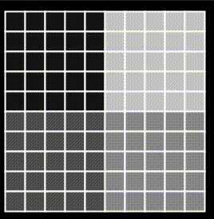

# Board and Boids Simulator

This project includes a collection of small board simulators and a boids simulator with preys and predators.




## Compilation

1. Clone the repository:

    ```bash
    git clone https://github.com/yourusername/board-and-boids-simulator.git
    ```

2. Navigate to the project directory:

    ```bash
    cd board-and-boids-simulator
    ```

3. Compile the project using the Makefile:

    ```bash
    make all
    ```

   This command will compile all the simulators and create executable files for each simulator.

## Usage

### Boids Simulator

The Boids simulator simulates the behavior of flocking birds with preys and predators.

1. **Run the Boids Simulator**:

    ```bash
    make runBoids
    ```

   This command compiles the Boids simulator and runs the executable to start the simulation.

### Other Simulators

You can also compile and run other simulators included in the project:

- **Balls Simulator**:
    ```bash
    make runBalls
    ```

- **Game of Life Simulator**:
    ```bash
    make runGameOfLife
    ```

- **Game of Immigration Simulator**:
    ```bash
    make runGameOfImmigration
    ```

- **Schelling Simulator**:
    ```bash
    make runSchelling
    ```

## Cleaning Up

If you want to clean up the compiled executables and object files, you can use:

```bash
make clean
```

## Contributing

Contributions to optimize algorithms, improve documentation, or add new features are welcome! Please open issues or submit pull requests.

## License

This project is licensed under the MIT License - see the [LICENSE](LICENSE) file for details.